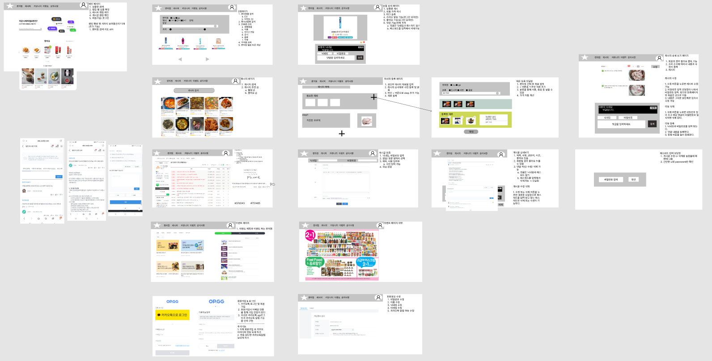

# **1bool1**


## 📝 프로젝트 개요
---
### **목표**

- 편의점 이용률이 높아지는 요즘 편의점 레시피 및 편의점 이벤트 상품을 제공하는 웹 프로젝트

### **기대 효과**

- 사용자들은 해당 서비스를 이용하여 최적의 선택을 할 수 있게 최적의 가격의 상품을 찾고 편의점에서만 만들 수 있는 특별한 음식들로 밥을 쉽게 섭취 할 수 있습니다.  

### **제작 의의**

### Anonymous communication 

- 익명의 의사소통 - 사람들과의 기본적인 의사소통을 익명으로 할 수 있어 부담을 내려 놓고 소통 할 수 있습니다.

### Recipe

- 레시피 - 사용자들간 편의점 음식들로만 구성된 음식을 제작 할 수 있습니다.

### Easy login

- 쉬운 로그인 - 카카오톡 Login API를 이용하여 회원 가입 절차가 필요 없이 로그인 가능합니다.

### Event

- 이벤트 - 이벤트를 크롤링 데이터로 수집하여 각각의 편의점 마다 세일하는 물품 및 이벤트 상품을 둘러 볼 수 있습니다. 

### Notification

- 알람 - 알람 기능을 통하여 사람들이 카카오톡 로그인이 정상적으로 완료 됨을 알 수 있습니다.


# ✈ 기획
## 📣ERD
---


## 🎇WireFrame
---


<br/><br/>

# 🍭배포
---
## 👨‍💻Client
---
```
$ cd frontend
$ npm install
$ npm run serve
```


## 👩‍💻Server
---
### 1. Java 설치
```
$ sudo apt-get install openjdk-8-jre
$ sudo apt-get install openjdk-8-jdk
```
### 2. Npm 설치
```
$ sudo apt install npm
```

### 3. Docker 설치
```
$ sudo apt install apt-transport-https ca-certificates curl gnupg-agent software-properties-common // 다음 패키지들을 설치
$ curl -fsSL https://download.docker.com/linux/ubuntu/gpg | sudo apt-key add – // Docker의 공식 GPG키를 추가한다.
$ sudo add-apt-repository "deb [arch=amd64] 
https://download.docker.com/linux/ubuntu $(lsb_release -cs) stable" // stable repository를 세팅하기 위한 명령어
$ sudo apt install docker-ce docker-ce-cli containerd.io // 가장 최신 버전의 Docker 엔진을 설치한다.
$ docker -v // 도커 설치 확인
```

### 4. Docker MariaDB install
```
$ sudo docker run --name DB이름 -p 3306:3306 -e MYSQL_ROOT_PASSWORD=비밀번호 - d mariadb // Docker로 Mariadb 설치 및 실행
```
### 5. Gradle install
```
$ apt-get update
$ apt-get install unzip wget
$ wget https://downloads.gradle-dn.com/distributions/gradle-6.7-bin.zip //gradle 6.7 설치
$ unzip gradle-6.7-bin.zip -d /opt
$ In -s /opt/gradle-6.7 /opt/gradle
$ vi /etc/profile.d/gradle.sh
```
-  
  ### 5-1. gradle 설정
  ```
  #/bin/bash
  export GRADLE_HOME=/opt/gradle
  export PATH=/opt/gradle/bin:${PATH}

  $ gradle -v //gradle 설치 확인
  ```
### 6. 프로젝트 설치 및 실행
```
$ git clone https://lab.ssafy.com/s06-final/S06P31D207        #프로젝트 받기(Git)
$ npm install #Front 빌드
$ npm run build #Front page 빌드
$ gradlew clean build #jar 파일 생성
```
### 7. NGINX 설정

-
  ### 7-1. NGINX 인증서 등록 
  ```
  $ sudo certbot certonly--standalone                                   
  [sudo] password for dev:   <비밀번호 혹은 그냥 엔터키>
  Saving debug log to /var/log/letsencrypt/letsencrypt.log
  Plugins selected: Authenticator standalone, Installer None
  Enter email address (used for urgent renewal and security notices)
  (Enter 'c' to cancel): 본인 받을 이메일

  - - - - - - - - - - - - - - - - - - - - - - - - - - - - - - - - - - - - - - - -
  Please read the Terms of Service at
  https://letsencrypt.org/documents/LE-SA-v1.2-November-15-2017.pdf. You must
  agree in order to register with the ACME server. Do you agree?
  - - - - - - - - - - - - - - - - - - - - - - - - - - - - - - - - - - - - - - - -
  (Y)es/(N)o: Y <- ACME 약관에 동의하는지 N선택시 진행불가

  - - - - - - - - - - - - - - - - - - - - - - - - - - - - - - - - - - - - - - - -
  Would you be willing, once your first certificate is successfully issued, to
  share your email address with the Electronic Frontier Foundation, a founding
  partner of the Let's Encrypt project and the non-profit organization that
  develops Certbot? We'd like to send you email about our work encrypting the web,
  EFF news, campaigns, and ways to support digital freedom.
  - - - - - - - - - - - - - - - - - - - - - - - - - - - - - - - - - - - - - - - -
  (Y)es/(N)o: N <- 이메일을 통해 Let's Encrypt 프로젝트 정보를 받아볼지
  Please enter in your domain name(s) (comma and/or space separated)
  (Enter 'c' to cancel): k6d207.p.ssafy.io  <- {1} 인증서를 발급할 도메인 입력


  IMPORTANT NOTES:
  - Congratulations! Your certificate and chain have been saved at:
    /etc/letsencrypt/live/k6d207.p.ssafy.io/fullchain.pem <- {2} 발급된 인증서 경로
    Your key file has been saved at:
    /etc/letsencrypt/live/k6d207.p.ssafy.io/privkey.pem <- {2} 발급된 인증서 경로
    ... 그 외 나머지 설명
  ```
  ### 7-2. NGINX default 파일 설정
  ```
  $ cd /etc/nginx/sites-enables
  $ sudo vi default // 설정파일 열기
  ```

  ```
  server{
          root /home/ubuntu/deploy/build;

          # Add index.php to the list if you are using PHP
          index index.html index.htm index.nginx-debian.html;

          server_name k6d207.p.ssafy.io;

          location / {
                  # First attempt to serve request as file, then
                  # as directory, then fall back to displaying a 404.
                  try_files $uri $uri/ /index.html;
                  #proxy_pass http://localhost:3000;
                  #return 301 https://$host$request_uri;

          }

          location /api{
                  proxy_pass http://localhost:8080;
                  proxy_http_version 1.1;
                  proxy_set_header Connection "";

                  include /etc/nginx/proxy_params;
          }
      listen [::]:443 ssl ipv6only=on; # managed by Certbot
      listen 443 ssl; # managed by Certbot
      ssl_certificate /etc/letsencrypt/live/k6d207.p.ssafy.io/fullchain.pem; # managed by Certbot
      ssl_certificate_key /etc/letsencrypt/live/k6d207.p.ssafy.io/privkey.pem; # managed by Certbot
      include /etc/letsencrypt/options-ssl-nginx.conf; # managed by Certbot
      ssl_dhparam /etc/letsencrypt/ssl-dhparams.pem; # managed by Certbot
  }
  server {
      if ($host = k6d207.p.ssafy.io) {
          return 301 https://$host$request_uri;
      } # managed by Certbot


          listen 80 ;
          listen [::]:80 ;
      server_name k6d207.p.ssafy.io;
      return 404; # managed by Certbot


  }

  ```
